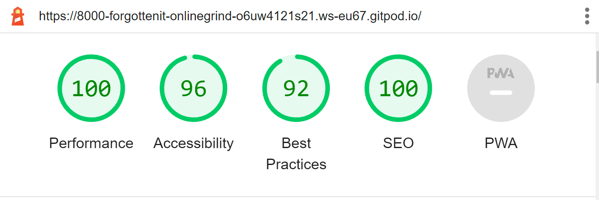

# Welcome to [Doctrina Online Grinds](https://8000-forgottenit-onlinegrind-o6uw4121s21.ws-eu67.gitpod.io/)

# Goal
The goal of this is website is to provide an Online Grinds Website for both Junior and Leaving Certificate Irish students. There is also a section for Teachers to sign up to provide grinds. It has an about section on the landing page with testimonials, then 3 sign up forms, one for Junior Cert subjects, one for Leaving Cert subjects and one for Teachers to submit their Cv

# Table of Contents

# UX
## User Goals
-	Find Grind providers Online
-	Have an easy method to submit details and options
-	Be reassured about quality of Tutors
-	Easy to research company through reviews and social media
- 	Find site that hires tutors to provide Grinds online that has a resource of students

## User Stories
-	As a parent/student, I want to be able to access quality Tutors
-   I want reassurance that all providers are qualified, experienced and vetted
-   I want options for how the service is provided and flexibility as opposed to "brick and morter" options that may not be easily accessible
-   I want the service to affordable
-   I want to receive feedback once my information has been submitted
-   As a Teacher/Tutor, I want an easy method to apply for a role
- 	I want access to more options to provide grinds as opposed to visiting or having people call to my home

## Site owners Goals
-	Instil confidence in users to maximise sign-up
-	Have easy to follow links for users and portray a positive experience
-   Have a variety of options to maximise customers around the country
-	Have a way to collect submitted data
-	Increase Brand awareness through use of Title and Social Media links
## Requirements
-	Easy to navigate on different devices
-	Multiple ways to contact Site, through different social media and form submissions
-	Easy and clear method to submit information and choices
-	Follow a clear layout
-	Make the site visually appealing
## Expectations
-	All links to be active and open in a new tab to not send users away from the site
-	Form submission to be able to collect multiple pieces of data at once (i.e. New forms not needed if more than one option picked)
-	Visually appealing on all devices
-	All images and forms to load and run at a high performance level

# Design Choices
## Fonts
On this site I used the Google Font Slabo 13px after experimenting with different styles.  I felt this had a “Code” like appearance which alluded to the fact that the service is provided online. This was coupled with the standard GitHub font Courier New, as the Slabo font was mainly to signify the “branding” and may have complicated the standard font for form submissions and would have appeared over-styled. As the Heading of each page includes the name of the site, I felt this gave a striking style and although I debated inserting a “Logo” instead, I preferred this look due to the nature of the website, I thought brand awareness outweighed the visual appeal of a Logo. Although, this could be changed in the future.
## Icons
I used FontAwesome for logos for Social Media sites as these are industry standards and easily recognisable.

## Colours
The colours I chose for the fonts #f4a162;(orange) and #3f6c51 (green) for the website were, along with the white background, to be representative of the nature of the company being an Irish company, so to have a green white and gold colouring. The colours for the testimonials were bright to indicate positivity. The form submission backgrounds were a linear mix of the orange and green, with a transparency to not block out the background images matching the images from the landing page, to give a level of visual consistency. 

## Structure
The website was built with a Breakpoint of 450px, below this point the Nav menu is made smaller and the border box removed to fit neater on the page, also, the form lengths are increased as to have a neater content.

 
# Wireframes

 
# Features
## Existing Features
### Navigation Bar
-	The Nav Bar includes links to form submissions, the style is changed below 450px width as to give a neater view on smaller screens. It contains a Home link, links to Junior Cert and Leaving Cert option submission forms and a link for Teachers to sign up to a apply to be Tutors for the Website.
### Landing page
### Ethos Section
This contains information about the Site and the services provided

### Testimonials
This area contains reviews of the service, as this is for demonstrative purposes, the reviews are created for that purpose.
### Sign-up Section
This contains three different options for sign up, one for Junior Cert Cycle students, one for Leaving Cert and one for Teachers, each link leads to a different form submission

### Footer
This contains links to Social Media sites that open in a new page, namely, Twitter, Facebook, YouTube and Instagram. This links all open on a new page.

## Submission Forms
Junior Cert, Leaving Cert and Teacher Submission forms. Each has a background, covered by the form in a transparent view. The Junior and Leaving Cert forms contain Checkboxes to select classes from the relevant cycles, the Teacher Submission form contains a text area box to submit a Cv. All three contain inputs for First Name, Last Name and Email, these are all set to required.

# Future Features 
-	Forms to submit to an accessible database that could be collected
-	Examined the option of having a "Burger" menu on the Nav Bar, but I felt I would be more comfortable implementing this with JavaScript

 
# Technologies used
## Languages
- HTML for structuring website
- CSS for styling website

## Tools
- GitPod and GitHub for Coding and Hosting the Website
- CodeInstitute for Mentors and Tutors
- LightHouse
- https://validator.w3.org/ for validating site
 
# Testing
-	HTML
No errors were returned when passing through the official W3C validator
- CSS
No errors were found when passing through the official (Jigsaw) validator

## Lighthouse

 
# General Testing

- After site was ran through w3 validators, the site was tested for functionality.
- Functionality testing involved ensuring all links were active, that all form submission sections that were set to "required" actually required input and that once forms were submitted that a confirmation message was shown
- Testing also involved general lay-out testing of alternate design choices and images before the ones used were settled upon.
- Finally, testing also involved demonstration of the active site to mt CodeInstitute Mentor 
# Deployment
Following writing the code then commiting and pushing to GitHub, this project was deployed using GitHub by the following steps.
-	Navigate to the repository on github and click 'Settings'.
-	Then select 'Pages' on the side navigation.
-	Select the 'None' dropdown, and then click 'master'.
-	Click on the 'Save' button.
-	Now the website is now live on  https://forgottenit.github.io/Online-Grinds/
-	If any changes are required, they can be done, commited and pushed to GitHub and the changes will be updated.

 
# Credits
## For coding help and advice
-	Simen Daehlin
-	Rohit Sharma
-	CodeInstitiute
 
## For content and style 
-	Wikipedia
-	CodeInstitute
-	FontAwesome
-	W3Schools.com
-	IStockPhoto.com and Pixabay.com for Images
